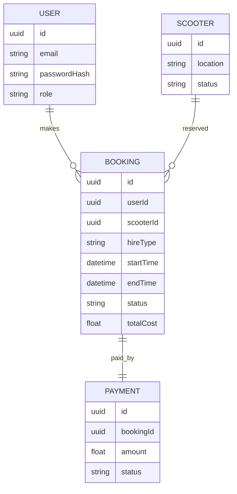

```mermaid
erDiagram

    USER {
        uuid id
        string email
        string passwordHash
        string role
    }

    SCOOTER {
        uuid id
        string location
        string status
    }

    BOOKING {
        uuid id
        uuid userId
        uuid scooterId
        string hireType
        datetime startTime
        datetime endTime
        string status
        float totalCost
    }

    PAYMENT {
        uuid id
        uuid bookingId
        float amount
        string status
    }

    USER ||--o{ BOOKING : makes
    SCOOTER ||--o{ BOOKING : reserved
    BOOKING ||--|| PAYMENT : paid_by
```